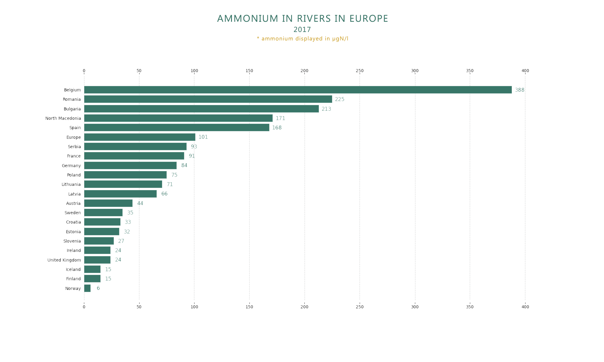
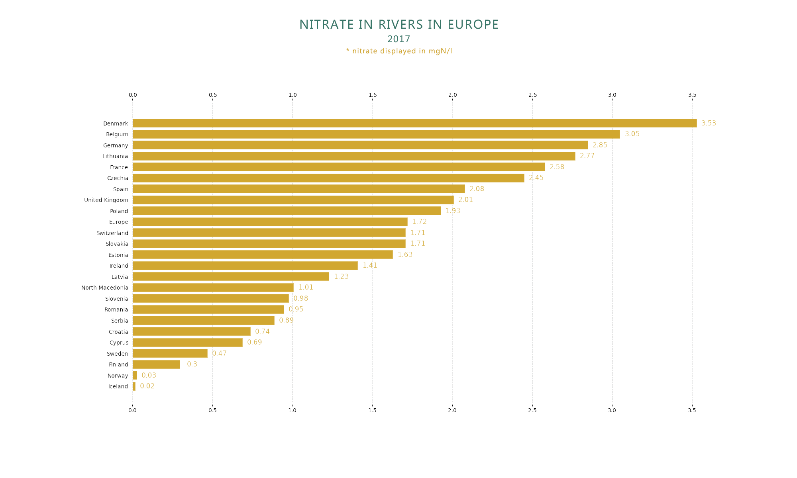

<strong>ABOUT</strong> 
 
This repo displays reported nitrate and ammonium in rivers across Europe for 2017. Included are original csv files from: https://data.europa.eu/data/datasets/dat-163-en?locale=en 
 
I modified these a bit and turned them into Excel sheets to have a simple code in python

<strong>SCREENSHOTS</strong>

